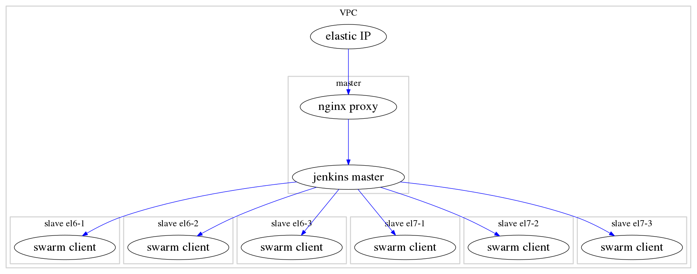

Jenkins LSST Stack Demo
=======================

Synopsis
---

This is a demonstration of deploying a complete
[`jenkins`](https://jenkins-ci.org/) master + build slaves environment to
[AWS](https://aws.amazon.com/) EC2 which is pre-configured to build the LSST
Stack.  The principle goal is to demonstrate a possible migration path away
from LSST DM's existing CI infrastructure.  The key feature improvements over
the existing [`buildbot`](http://buildbot.net/) driven system are:

* concurrently running a build on multiple operating systems
* multiple independent builds of the same job occurring in parallel

A secondary objective is provide an example of deploying a moderately complex
application onto a modern cloud infrastructure.

High level architecture
---



The instances running the jenkins master and slave processes are deployed into
an AWS "Virtual Private Cloud" or [VPC](https://aws.amazon.com/vpc/).  Using a
non-default VPC (historically, AWS had separate classic and VPC environments;
all newly created AWS accounts have a default VPC in each region that more or
less emulates the "classic" behavior) allows for direct control over the
RFC1918 private address space.  A benefit of this is that the master instance
can have a fixed IP address which the slaves can locate by convention instead
of requiring either the address to be injected or use of a service discovery
mechanism.

Tooling
---

### `packer`

The Centos project supplies "official" `x86_64 HVM` Amazon Machine Images
(AMIs) for both Centos 6 and 7 in all EC2 regions.  However, the images are
slightly out of date, 6.5 vs. 6.6 and 7.0 vs. 7.1, and the Centos 6 image does
not include [`cloud-init`](https://cloudinit.readthedocs.org/en/latest/) or is
it compatible with vagrant.  The popular
[`chef/bento`](https://github.com/chef/bento) [`packer`](https://packer.io/)
templates were modified to install/configure `cloud-init` for Centos 6, update
the images to the current minor releases, and make both images more friendly
for usage with vagrant.

### `terraform`

As with any network environment, a VPC requires a fair amount of configuration.
Instead of requiring manual interaction via the AWS console,
[`terraform`](https://www.terraform.io/) is used to configure fully configure
the VPC.  Note that terraform has the capability to spawn EC2 instances and
could completely replace vagrant at the expense of loosing a convenient
development/debugging mechanism.

The terraform configuration files are under the ['terraform'](./terraform)
directory.

### `vagrant`

EC2 instances are created/destroyed via
[`vagrant`](https://www.vagrantup.com/).  Vagrant is also used to pass "User
Data" to cloud-init and to run puppet on each node in "masterless" mode.

Vagrant is configured via the ['Vagrantfile'](./Vagrantfile).

### `cloud-init`

There are a number of level configurations needed in a cloud environment.
Including:

  * ssh key injection / sudo management
  * dynamic resizing of the instance's block storage
  * hostname/host file management

[`cloud-init`](https://cloudinit.readthedocs.org/en/latest/) is relied upon to
provide those functions in demo.

### `puppet`

The bulk of the "heavy lifting" (configuring the instances) in this demo is
done by a composition of [`puppet`](https://puppetlabs.com/) modules.   This is
implemented via a bundled "site" module that implements the [Roles and
Profiles](http://www.craigdunn.org/2012/05/239/) pattern.

  * The puppet modules in use are listed in the [Puppetfile](./Puppetfile).
  * The site module is under the [`jenkins_demo`](./jenkins_demo) directory.

Notable omissions
---

### jenkins security

_jenkins does not have any access control enabled.  This means that *anyone*
can change anything, include the jenkins configuration, essentially allowing
arbitrary code to be executed under the jenkins role account._

There is on going development to improve the
[`rtyle/jenkins`](https://forge.puppetlabs.com/rtyler/jenkins) puppet module so
that is can handle the complete set of security configuration needed for a
production deployment without requiring manual configuration by the
administrator.

### DNS

The demo attaches an elastic IP address (public IP) but does not manage DNS
configuration for this address.  There are a number of ways of automatically
handling this including via the terraform aws provider.

### jenkins plugins

There are a number of plugins that are not configured via this demo as it would
require exposing secrets. This includes github oauth integration, hipchat
notifications, and email notifications.

### metric collection

The demo enables cloud watch metric collection about the instances which is
completely external to jenkins and not visible external to the AWS account.  A
full production deployment would likely involved additional jenkins plugins for
metric collection and instance level metrics collected external to jenkins
which are then made available to end users via a web interface.

### backups

There are absolutely no provisions taken for backing up either jenkins data or
snapshotting the instances.

Prerequisites
-------------

* Vagrant 1.7.x
* `git` - needed to clone this repo


Vagrant plugins
---------------

These are required:

* vagrant-puppet-install
* vagrant-librarian-puppet '~> 0.9.0'
* vagrant-aws '~> 0.7.0'

Sandbox
-------
    export AWS_ACCESS_KEY_ID=<...>
    export AWS_SECRET_ACCESS_KEY=<...>
    export AWS_REGION=us-east-1

    git clone -b builder/aws https://github.com/jhoblitt/bento.git
    cd bento
    mkdir bin
    cd bin
    wget https://dl.bintray.com/mitchellh/packer/packer_0.7.5_linux_amd64.zip
    unzip packer_0.7.5_linux_amd64.zip
    cd ../packer

    # centos 6 x86_64 HVM https://aws.amazon.com/marketplace/pp/B00NQAYLWO
    sed -i -e "s/us-west-2/${AWS_REGION}/" centos-6.6-x86_64.json
    sed -i -e "s/ami-81d092b1/ami-c2a818aa/" centos-6.6-x86_64.json

    # centos 7 x86_64 HVM https://aws.amazon.com/marketplace/pp/B00O7WM7QW
    sed -i -e "s/us-west-2/${AWS_REGION}/" centos-7.1-x86_64.json
    sed -i -e "s/ami-c7d092f7/ami-96a818fe/" centos-7.1-x86_64.json

    # sanity check
    git diff
    ../bin/packer build --only=amazon-ebs centos-6.6-x86_64.json

```
==> Builds finished. The artifacts of successful builds are:
--> amazon-ebs: AMIs were created:

us-east-1: ami-92ccd2fa
--> amazon-ebs: 'aws' provider box: ../builds/aws/opscode_centos-6.6_chef-provisionerless.box
```
    ../bin/packer build --only=amazon-ebs centos-7.1-x86_64.json

```
==> Builds finished. The artifacts of successful builds are:
--> amazon-ebs: AMIs were created:

us-east-1: ami-feccd296
--> amazon-ebs: 'aws' provider box: ../builds/aws/opscode_centos-7.1_chef-provisionerless.box
```

    export CENTOS6_AMI=ami-92ccd2fa
    export CENTOS7_AMI=ami-feccd296
    export MASTER_AMI=$CENTOS7_AMI
    cd ..

    git clone git@github.com:jhoblitt/sandbox-jenkins-demo.git
    cd sandbox-jenkins-demo

### Generate ssh key pair

The ssh key pair is required for both terraform and vagrant.

    (cd jenkins_demo/templates; make)

    cd terraform
    make

    export TF_VAR_aws_access_key=$AWS_ACCESS_KEY_ID
    export TF_VAR_aws_secret_key=$AWS_SECRET_ACCESS_KEY
    export TF_VAR_aws_region=$AWS_REGION

    ./bin/terraform plan
    ./bin/terraform apply

    vagrant plugin install vagrant-puppet-install
    vagrant plugin install vagrant-librarian-puppet --plugin-version '~> 0.9.0'
    vagrant plugin install vagrant-aws --plugin-version '~> 0.6.0'

    # sanity check
    vagrant plugin list

    export VAGRANT_DEFAULT_PROVIDER='aws'
    export VAGRANT_NO_PARALLEL='yes'
    vagrant up

Quickie guide
-------------

With vagrant, packer, terraform, and the AWS keys enved up:

```
    1	13:53	git clone -b builder/aws https://github.com/jhoblitt/bento.git
     2	13:53	cd bento
     3	13:53	cd packer
     4	13:53	sed -i -e "s/us-west-2/${AWS_REGION}/" centos-6.6-x86_64.json
     5	13:53	sed -i -e "s/ami-81d092b1/ami-c2a818aa/" centos-6.6-x86_64.json
     6	13:54	sed -i -e "s/us-west-2/${AWS_REGION}/" centos-7.1-x86_64.json
     7	13:54	sed -i -e "s/ami-c7d092f7/ami-96a818fe/" centos-7.1-x86_64.json
     8	13:54	packer build --only=amazon-ebs centos-6.6-x86_64.json
     9	14:05	setenv CENTOS6_AMI ami-9a031af2
    10	14:05	packer build --only=amazon-ebs centos-7.1-x86_64.json
    11	14:13	setenv CENTOS7_AMI ami-70051c18
    12	14:13	setenv MASTER_AMI $CENTOS7_AMI
    13	14:14	cd ..
    14	14:15	git clone github.com:jhoblitt/sandbox-jenkins-demo.git
    15	14:15	cd sandbox-jenkins-demo/
    16	14:16	cd terraform/
    17	14:17	setenv TF_VAR_aws_access_key $AWS_ACCESS_KEY
    18	14:18	setenv TF_VAR_aws_secret_key $AWS_SECRET_KEY
    19	14:18	setenv TF_VAR_aws_region $AWS_RE9	terraform plan
    21	14:19	terraform apply
    22	14:21	terraform apply
    23	14:22	pwd
    24	14:22	ls
    25	14:24	cat > aws.rb
    26	14:26	setenv VAGRANT_DEFAULT_PROVIDER aws
    27	14:26	setenv VAGRANT_NO_PARALLEL yes
    vagrant up
    
```
See Also
===
* [`jenkins`](https://jenkins-ci.org/)
* [AWS](https://aws.amazon.com/)
* [VPC](https://aws.amazon.com/vpc/)
* [`buildbot`](http://buildbot.net/)
* [`cloud-init`](https://cloudinit.readthedocs.org/en/latest/)
* [`chef/bento`](https://github.com/chef/bento)
* [`packer`](https://packer.io/)
* [`terraform`](https://www.terraform.io/)
* [`vagrant`](https://www.vagrantup.com/)
* [`puppet`](https://puppetlabs.com/)
