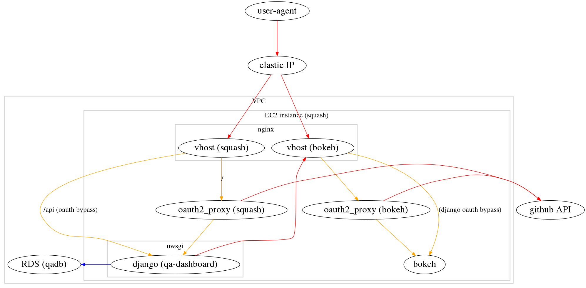

Squash deployment
===

These are condensed deployment instructions intended for a developer working on
only the Squash/qa-dashboard components.  There are more pedantic instructions
in the primary [README.md](./README.md).

Prerequisites
---

* vagrant >= 1.8.1
* `git` (needed to clone this repo)
* ruby >= 1.9.3
* ruby bundler gem

Clone Source
---

    git clone git@github.com:lsst-sqre/sandbox-jenkins-demo.git
    cd sandbox-jenkins-demo-squashtest/

Configuration
---

    export AWS_ACCESS_KEY_ID=<...>
    export AWS_SECRET_ACCESS_KEY=<...>
    export AWS_DEFAULT_REGION=us-west-2

    export SQUASH_AMI=ami-a613e4c6

    export TF_VAR_aws_access_key=$AWS_ACCESS_KEY_ID
    export TF_VAR_aws_secret_key=$AWS_SECRET_ACCESS_KEY
    export TF_VAR_aws_default_region=$AWS_DEFAULT_REGION
    export TF_VAR_demo_name=${USER}-squash
    export TF_VAR_aws_zone_id=Z3TH0HRSNU67AM
    export TF_VAR_domain_name=lsst.codes
    # must be at least 8 chars
    export TF_VAR_rds_password=<...>

It is recommended to save the env var configuration in a file named `creds.sh`
for convenience.

    cat > creds.sh <<END
    export AWS_ACCESS_KEY_ID=$AWS_ACCESS_KEY_ID
    export AWS_SECRET_ACCESS_KEY=$AWS_SECRET_ACCESS_KEY
    export AWS_DEFAULT_REGION=$AWS_DEFAULT_REGION

    export SQUASH_AMI=$SQUASH_AMI
    export VAGRANT_DEFAULT_PROVIDER='aws'
    export VAGRANT_NO_PARALLEL='yes'

    export TF_VAR_aws_access_key=$TF_VAR_aws_access_key
    export TF_VAR_aws_secret_key=$TF_VAR_aws_secret_key
    export TF_VAR_aws_default_region=$TF_VAR_aws_default_region
    export TF_VAR_demo_name=$TF_VAR_demo_name
    export TF_VAR_aws_zone_id=$TF_VAR_aws_zone_id
    export TF_VAR_domain_name=$TF_VAR_domain_name
    export TF_VAR_rds_password=$TF_VAR_rds_password
    END

Install `eyaml` key ring
---

    mkdir .lsst-certs
    cd .lsst-certs
    git init
    git remote add origin ~/Dropbox/lsst-sqre/git/lsst-certs.git
    git config core.sparseCheckout true
    echo "eyaml-keys/" >> .git/info/sparse-checkout
    git pull --depth=1 origin master
    cd ..
    ln -s .lsst-certs/eyaml-keys keys

Generate ssh key pair
---

    (cd jenkins_demo/templates; make)

Create AWS VPC resources
---

    . creds.sh
    cd terraform
    # install terraform locally
    make
    # only if this is a NON-PRODUCTION instance
    make dev
    # sanity check
    ./bin/terraform plan
    # create AWS VPC env
    ./bin/terraform apply
    cd ..

Decrypt eyaml values and install puppet modules
---

    bundle install
    bundle exec rake decrypt
    bundle exec librarian-puppet install

NOTE: make sure you are running this on a clean repository otherwise the 'bundle exec rake decrypt' will not update the corresponding yaml files.

Configure github oauth2
---

`oauth2_proxy` is used to provide basic user authentication.  At present, there
is no programmatic way to register an oauth application with github and manual
configuration is required.

A `squash` deployment technically requires two applications to be registered
with github due to different callback URLs being needed for `qa-dashboard` and
the `bokeh` server.  However, in practice, it appears that only `qa-dashboard`
needs to be registered as any websocket connections to `bokeh` that do not
already have a valid `oauth2_proxy` cookie would be unable to complete the
oauth2 authentication process.

This one-liner will construct the appropriate callback URL for the current
sandbox.

    (cd ./terraform; ./bin/terraform show | grep SQUASH_FQDN | sed -e 's/.*\=\s\(.*\)/https:\/\/\1\/oauth2\/callback/')

Example output.:

    https://jhoblitt-squash-squash.lsst.codes/oauth2/callback

### Register a new application

A "personal" application may be registered via:

https://github.com/settings/applications/new

**Note that a production application should be attached to a github org.**

An application name and homepage URL are required but the values are not
significant. The callback URL must __exactly__ match the constructed URL.

### Edit oauth2 configuration

    bundle exec rake edit[hieradata/role/squash.eyaml]

Insert the `Client ID` and `Client Secret` strings into the `oauth_config`
hash.

    jenkins_demo::profile::squash::oauth_config:
      client_id: XXXXXXXXXXXXXXXXXXXX
      client_secret: XXXXXXXXXXXXXXXXXXXXXXXXXXXXXXXXXXXXXXXX

Values in the `oauth_config` hash are used by both `oauth2_proxy` instances.

### github oauth2 documentation

Useful documentation for understanding github's oauth2 support:

* https://developer.github.com/v3/oauth/
* https://developer.github.com/guides/basics-of-authentication/

Change qa-dashboard repo and ref
---

The source git repo and ref the qa-dashboard sources are fetched from can be
overridden via hiera.

Example of switch to a development fork/branch:

    $ git diff
    diff --git a/hieradata/role/squash.yaml b/hieradata/role/squash.yaml
    index e657f9b..390fc77 100644
    --- a/hieradata/role/squash.yaml
    +++ b/hieradata/role/squash.yaml
    @@ -1,8 +1,8 @@
     ---
     classes:
       - jenkins_demo::role::squash
    -#jenkins_demo::profile::squash::repo: https://github.com/lsst-sqre/qa-dashboard.git
    -#jenkins_demo::profile::squash::ref: master
    +jenkins_demo::profile::squash::repo: https://github.com/jhoblitt/qa-dashboard.git
    +jenkins_demo::profile::squash::ref: tickets/DM-5844
     #jenkins_demo::profile::squash::squash_fqdn: squash
     #jenkins_demo::profile::squash::bokeh_fqdn: bokeh
     #jenkins_demo::profile::squash::bokeh_instances: 1

Start squash VM instance
---

    . creds.sh
    vagrant up squash

Occasionally (rarely), there are issues with the yum mirror selected (luck of
the draw) for downloading required packages. If this happens on the initial
deployment, it is recommended to destroy and recreate the instance.

Initialize django database
---

    vagrant ssh squash
    cd /opt/apps/qa-dashboard
    . venv/bin/activate
    cd squash

    export QA_USER="nobody"
    export QA_USER_EMAIL=${USER}@example.com
    export DJANGO_SETTINGS_MODULE="squash.settings.production"

    # XXX this is an ugly hack
    # sudo -E -u squash python manage.py makemigrations
    # running makemigrations under sudo fails:
    # ImportError: No module named django.core.management
    # despite VIRTUAL_ENV being preserved

    # there does not appear to an option to change the migration file path
    sudo chmod 777 /opt/apps/qa-dashboard/squash/dashboard/migrations/
    python manage.py makemigrations
    python manage.py migrate
    python manage.py createsuperuser --username $QA_USER --email $QA_USER_EMAIL --noinput
    python manage.py loaddata initial_data

    # the password can be changed after the fact via
    python manage.py changepassword $QA_USER

Applying changes to a running squash VM instance
---

    . creds.sh
    bundle exec librarian-puppet update
    vagrant rsync squash
    vagrant provision squash

Cleanup
---

    . creds.sh
    # VM must be destroyed before some AWS resources may be deallocated
    vagrant destroy -f squash
    cd terraform
    ./bin/terraform destroy --force
    cd ..
    rm -rf .lsst-certs
